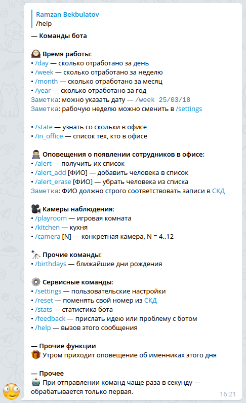
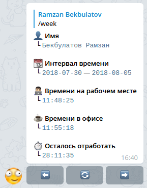
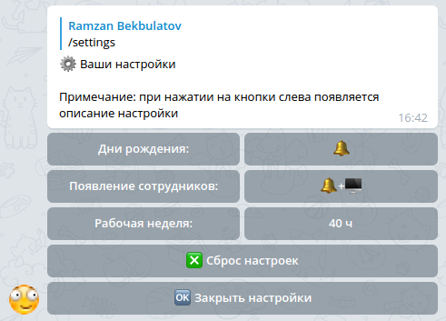
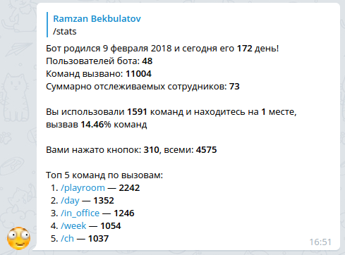
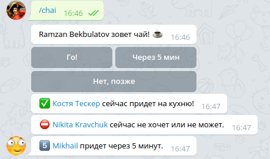

# rfd_life bot


## Функциональность

### Общие команды

> 

### Скрытые команды

> 


## Примеры

### /week

> 

### /settings

Персональные настройки бота и оповещений
> 

### /stats

Команда для вывода статистики
> 

### /chai

Команда для приглашения коллег-друзей на кухню
> 


## Как запустить

### 1. Установить необходимые модули

```sh
pip3 install -r requirements.txt
```

### 2. Выставить токены и пароли для доступа

Получить токен Telegram-бота можно через [@BotFather](https://t.me/BotFather).

Подробнее про способы выставления в файле [tokens.py](tokens.py).

### 3. Запуск

Запустить [main.py](main.py) вручную или через скрипт-обёртку [run.sh](run.sh) для автоматического перезапуска.


## Связанные сервисы

[](https://vk.com/rfd_life)

## Контакты

[![](https://img.shields.io/badge/-%40rm__bk-blue.svg?logo=data:image/png;base64,iVBORw0KGgoAAAANSUhEUgAAABQAAAAUCAYAAACNiR0NAAAEbklEQVQ4y62US2xUdRjFf%2F%2F%2FfUynnXaGKW15FHnVKm8SRCFB3ZhYRVQSISHKBhKjK2JiTIyuXJC40oUrY%2BJGTZSABomiC0kUFYEIFRWrQi1tmXb6mE7be%2BfOvf%2F7%2F1z0Ydh71t93vpPz5RxlUoujFSOB4dxQQGKFUs2AFRIr9%2FRVzdO%2FVZNVvqPsjqL31%2BYl3icNjh4dDAyNrsPzm%2FL4riZOhRbfwWUeAohAe9ZhrG6af6mYF27X0gPVRHZ6jsYquDxpGAjSJ7rz3om2jHqv2VOLuwtQCwpHA8NvExEXx6JnTg6Eb0%2FU7UpPK3Kewp3bI05hOrEIkHPV1aPduRePbStesAKhseQ8B63V3HRHk8t3o9HLx3unTlRju7KjQVPwFM68chHwNLRlNB0NmtlEtr%2FZO%2FXjlwNBj1aKxM4rjJKUjKv5ZijY2%2FPF8JmuvE%2Fe%2B29gAVqBo6CeCkOBoT3rkFgo14y8%2B%2FCy9bs6sv2rci66HCZcG69lX%2Fq%2B%2FEGrr2lxFbERxAoiggY0Qjk0XB6NGJpN2NORZU3Oo8lRiBX14Z%2FVjypROnc46zqcvRUe7avEhVVNLnVjAcHVEBnL9cmIa%2BMRSzzNqzuWcvrxTk49tpINBZ8%2FKnW6WjzOl2q7LowEewDci6Nh57nh4Lmcq0itRaMYDQ3DMwltjR777sqxv6uFA13Nd1jQOx6R1aAEYmO5Ol5%2FFjjvfnZz5sDgdPJAq68RC4OzCe1ZhyP3t3Ho7jwbij4ApUrITJKybmmOSpRyqxpT8B2SVCj6Dr3j9e0A7ve3wy6FwtOKG1N1jm1v5Y3d7YtKarHhymCVfKPHpuUtAFwZrzMwk7A%2B72OskPcUlZopzHnoaJOKYK2lkHG4NBJy%2FKcxfh2LCGoxlwerrCg0LJIB9FfrRIkFmXtcnFpEJAXQPaubfnQgmK6nFD3FlXLEa%2BdK7Pn4Jt%2FerLCxNcua1qY7%2FLtYqqERsIISYSwwrGh0RwD00c3Fk1taM1%2BVZhJiKyzJaDYub6CaCH8HQjBW4cyv5TsIf5%2BIaHQUqVhEhGpk6Mr75wF0aTZJugv%2Bu1YEY4XUWlIrNHmKn8s1zo7E7Ds1yJMn%2BxcJ%2ByYjChmNFZiqGVobHJ5Y1%2Fw%2BgDsaGnrWNn91qRRe%2BLp%2Feld3a5bEWFY0aM4N1zg9AJ3LGvm8b4pHT9xkdYsHVshqhSPC7Yk6h7YW3%2BlZ2zwAoH4ph6xo9vhhKOg8cmbgulEq197kYUWI5%2BPna%2FAcRX81JjLChmIGC%2FSVa%2BzszPV9un%2FNFoRkZbOHrqfCWJiitRp6ZH1%2Bj68YuTFVJ04FX4GrhNQKUWLpzHl0F3wmaoYbkxH3Lm24%2Bvru9gcLvpPUzHz0FoI%2FW7fE1vYe3lK8b%2B%2FalhNBnFIOEyZDgxXBpEJ5NqE0m5BxVPpQZ%2B6tV3a17xAYGw0NC621WLBKwXQ9pcV3hw9vzh3M%2BWr74ExyMDGy7XaQLHM1srUt2681l5%2Fqyn9shH8mohTf0TgK0vmWVSLC%2F4l%2FAXWxRtaDbtHIAAAAAElFTkSuQmCC)](https://t.me/rm_bk)
